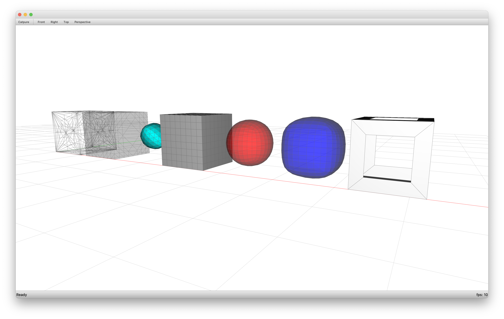

************************
Mesh Subdivision Schemes
************************

.. rst-class:: lead

    Application of subdivision schemes to geometric shapes.
    Most schemes are applied to a simple box.
    Loop starts from a tetrahedron.

From left to right:

* Tri
* Corner
* Loop (tetrahedron)
* Quad
* Catmull-Clark
* Doo-Sabin
* Frames

.. literalinclude:: script.py
    :language: python
